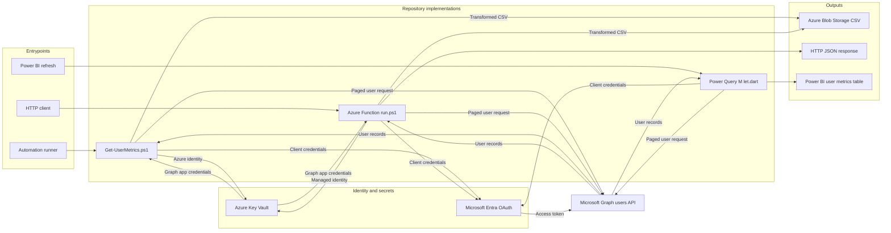

# Architecture

The repository provides three ways to retrieve and transform Microsoft Entra user metrics:

- `Get-UserMetrics.ps1` runs as a batch job and uploads a dated CSV to Azure Blob Storage.
- `run.ps1` runs as an HTTP-triggered Azure Function, uploads a CSV, and returns a JSON status response.
- `let.dart` contains a Power Query M query that returns the transformed users directly to Power BI.

## Security Boundary

The PowerShell paths retrieve Microsoft Graph application credentials from Azure Key Vault. The Power Query path currently requires credential values in its query configuration; use a controlled parameter or supported secret-management mechanism rather than committing credentials to source control.